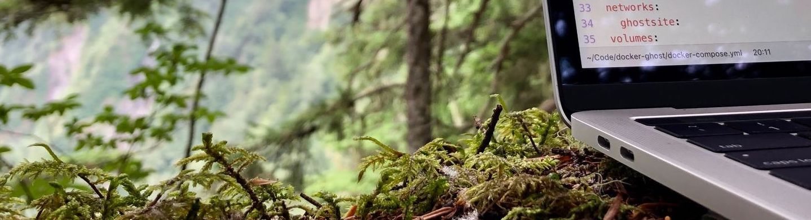

### 👋 Folks, g'day!

> ***Noah here, with you @ sea level, climbing 2500*** ✈️

I'm a **Senior DevOps Engineer** based in SEA 🐋

- 👔 I currently work in Observability for a major U.S. Airline ✈️
- 🧑‍💻 I’m currently learning Go writing custom observability tools
- 💬 Ask me about Kubernetes ☸️, AWS,  aviation 🛫🌥🛬 or transit 🚊🚃🚎🚌
- 📫 How to reach me: [📧 email ](public@noahsbwilliams.com)

#### Some recent work includes...

- 🔍 Implementing [OpenTelemetry](https://opentelemetry.io) for distributed tracing
- 🐍 Writing CloudFormation modules in Python using [Troposphere](https://troposphere.readthedocs.io/en/latest/)
- 🐳 Building and refactoring slim platform images for Node, Python, Ruby, Java
- ☸️ Deploying and managing a Kubernetes-based service platform
- ☁️ Constructing and versioning cloud environments with [Terraform](https://terraform.io) 
- 📱 iOS CI/CD with [Fastlane](https://fastlane.tools) & [GitHub Actions](https://github.com/features/actions)
